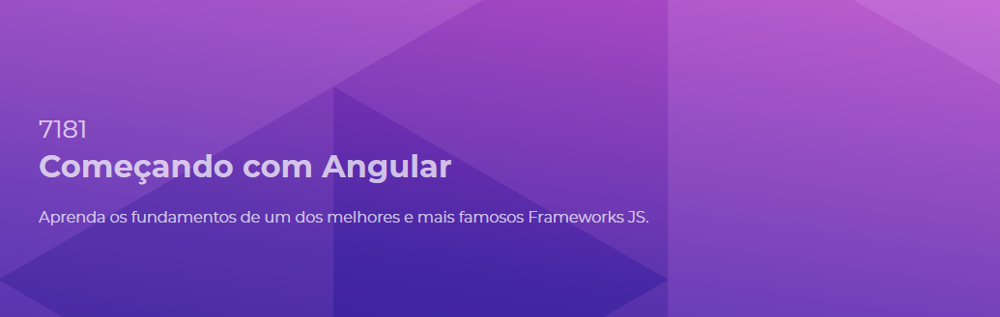

# Página do Curso
https://balta.io/cursos/7181

# Aulas

| Título                        | Duração (min) |
| :---:                         | : --- :       |
| Apresentação                  | 1             |
| Ferramentas                   | 2             |
| Criando um projeto            | 6             |
| Módulos e Componentes         | 6             |
| Rodando a aplicação           | 13            |
| Variaveis e tipos             | 3             |
| Exibindo dados                | 7             |
| Objetos complexos             | 5             |
| ngIf                          | 8             |
| Removendo um item             | 3             |
| Alterando um item             | 7             |
| Forms básicos                 | 2             |
| Exibindo as validações        | 10            |
| Desabilitando o botão         | 5             |
| Adicionando uma tarefa        | 1             |
| Salvando os itens             | 5             |
| Lendo os itens                | 5             |
| Estilizando o corpo da página | 4             |
| Estilizando os items          | 9             |
| Estilizando o botão           | 6             |
| Alterando as visualiações     | 4             |
| Estilizando o formulário      | 6             |
| Estilizando ações da lista    | 3             |
| Build toques finais           | 6             |